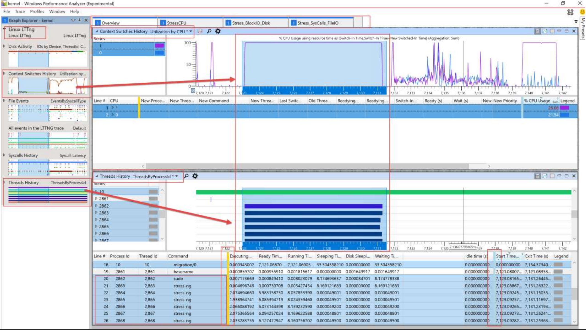

# Microsoft Performance Tools Linux / Android

> This repo contains various Linux and Android Performance Analysis tools built with the [Microsoft Performance Toolkit SDK](https://github.com/microsoft/microsoft-performance-toolkit-sdk).

> Tools are built with open source .NET Core and can be run on the cmd-line or in the WPA GUI. All the logs that are supported are open source. 

>Not only are the raw logs parsed, but a lot of smart post processing / correlation is done to make your life easier as a perf analyst. We hope you can solve & debug tough issues on you or your customers systems with this toolset!

> Tracing supported: 
- [LTTng](https://lttng.org) (Kernel CPU scheduling, Processes, Threads, Block IO/Disk, Syscalls, File events, etc)
- [perf](https://perf.wiki.kernel.org/) CPU Sampling(cpu-clock)
- [Perfetto](https://perfetto.dev/) Android & Chromium (CPU Scheduling, CPU Sampling, CPU Frequency, FTrace, Android Logs, Generic Events / Default Tracks, GPU Counters, Jank Detection, Processes, Android Packages)

> Logs supported: 
- [Dmesg](https://en.wikipedia.org/wiki/Dmesg)
- [Cloud-Init](https://cloud-init.io/)
- [WaLinuxAgent](https://github.com/Azure/WALinuxAgent)
- [AndroidLogcat](https://developer.android.com/studio/command-line/logcat)

**Optional** WPA GUI:


# Presentations

If you want to see a demo or get more in-depth info on using these tools (LTTng) check out a talk given at the [Linux Tracing Summit](https://www.tracingsummit.org/ts/2019/):
>Linux & Windows Perf Analysis using WPA (LTTng), ([slides](https://www.tracingsummit.org/ts/2019/files/Tracingsummit2019-wpa-berg-gibeau.pdf)) ([video](https://youtu.be/HUbVaIi-aaw))

# Blog Posts

Featuring some use-cases and some walkthroughs

- [New tools for analyzing Android, Linux, and Chromium browser performance – Microsoft-Performance-Tools for Linux-Android](https://devblogs.microsoft.com/performance-diagnostics/new-tools-for-analyzing-android-linux-and-chromium-browser-performance/)
- [Perfetto tooling for analyzing Android, Linux, and Chromium browser performance – Microsoft-Performance-Tools-Linux-Android](https://devblogs.microsoft.com/performance-diagnostics/perfetto-tooling-for-analyzing-android-linux-and-chromium-browser-performance-microsoft-performance-tools-linux-android/)
- [New Android logcat support available in Microsoft Performance Tools for Linux & Android](https://devblogs.microsoft.com/performance-diagnostics/new-android-logcat-support-available-in-microsoft-performance-tools-for-linux-android/)

# Prerequisites

## Runtime prereqs
- [.NET Core Runtime 3.1.x](https://dotnet.microsoft.com/download/dotnet-core/3.1)

## Dev prereqs
- [.NET Core SDK 3.1.x](https://dotnet.microsoft.com/download/dotnet-core/3.1)
- [Visual Studio](https://visualstudio.microsoft.com/), [VSCode](https://visualstudio.microsoft.com/), or your favorite editor!

# Download
- **For plugins Download** see [Releases](https://github.com/microsoft/Microsoft-Performance-Tools-Linux/releases)

- **NuGet Pkgs** see [PerformanceToolkitPlugins](https://www.nuget.org/profiles/PerformanceToolkitPlugins)

- **(Windows Only GUI - Install)** Using the WPA GUI to load these tools as plugins
  - Download the latest Store [Windows Performance Analyzer (Preview)](https://www.microsoft.com/en-us/p/windows-performance-analyzer-preview/9n58qrw40dfw)

# How to run the tools
The tools can be run in several modes:

- **Cross-platform with .NET Core** (Any OS that .NET Core supports)
  - Used as a library to process traces / logs programatically in a .NET Core language like C#
    - Examples: 
    - [LTTng 1](LTTngDriver/Program.cs), [LTTng 2](LTTngDataExtUnitTest/LTTngUnitTest.cs)
    - [Perf](PerfUnitTest/PerfUnitTest.cs)
    - [LinuxLogs](LinuxLogParsers/LinuxLogParsersUnitTest/LinuxLogParsersUnitTest.cs)
    - [Perfetto](PerfettoUnitTest/PerfettoUnitTest.cs)
  - With a driver program for example dumping to screen or text format
    - ./LTTngDriver.exe LTTngKernelTraceFolder
    - ./LTTngDriver.exe LTTng-Kernel-Trace.ctf (trace folder is zipped and renamed to .ctf)
- **(Windows Only - Run)** Using the WPA GUI to load these tools as plugins
  - WPA needs to be told where to find these additional plugins. 
  - Using [Windows Launcher](Launcher/Windows/LaunchWpaPerfToolsLinuxAndroid.ps1) script
    ```powershell
    .\LaunchWpaPerfToolsLinuxAndroid.ps1 -i c:\PATH\TO\lttng-kernel-trace.ctf
    ```
    - -LinuxPerfToolsPluginFolder path may need to be specified if not auto-found correctly
  - In Command Prompt with -addsearchdir and -i trace file:
      ```dos
        wpa.exe -addsearchdir %HOMEDRIVE%%HOMEPATH%\Downloads\Microsoft-Performance-Tools-Linux-Android-1.2\Microsoft-Performance-Tools-Linux-Android\MicrosoftPerfToolkitAddins -i c:\PATH\TO\lttng-kernel-trace.ctf
     ```
  - OR with Env Variable to pick file from UI
       ```dos
        SET WPA_ADDITIONAL_SEARCH_DIRECTORIES=%HOMEDRIVE%%HOMEPATH%\Downloads\Microsoft-Performance-Tools-Linux-Android-1.2\Microsoft-Performance-Tools-Linux-Android\MicrosoftPerfToolkitAddins
        wpa.exe
      ```
  - Optional Troubleshooting - Verify that this WPA version supports plugins
    - In Command Prompt - Example:
        ```dos
        wpa.exe /?
        "C:\Program Files\WindowsApps\Microsoft.WindowsPerformanceAnalyzerPreview_10.0.22504.0_x64__8wekyb3d8bbwe\10\Windows Performance Toolkit\wpa.exe" /?
        ```
    - Verify that these 2 command line WPA options are supported:
      - OPTIONS: **-addsearchdir PATH**. Adds a directory path to the plugin search path. ....
      - ENVIRONMENT VARIABLES: **WPA_ADDITIONAL_SEARCH_DIRECTORIES** - A semicolon (;) delimited list of additional directories to search for plugins. Equivalent to the -addsearchdir option.
- **(Windows) Command-line dumping to a text format** based on the WPA UI (say CSV) (wpaexporter.exe)
    ```dos
    "C:\Program Files\WindowsApps\Microsoft.WindowsPerformanceAnalyzerPreview_10.0.22504.0_x64__8wekyb3d8bbwe\10\Windows Performance Toolkit\wpaexporter.exe" -addsearchdir PLUGIN_FOLDER -i traceFile
    ```

# How to capture a trace or logs
- Linux 
  - Please see [Linux Trace Log Capture](LinuxTraceLogCapture.md)
- Perfetto
  - Android - Please see [Record traces on Android](https://perfetto.dev/docs/quickstart/android-tracing)
  - Linux - Please see [Record traces on Linux](https://perfetto.dev/docs/quickstart/linux-tracing)
  - Chromium - In chrome://tracing/ Record choose "Use protobuf" OR use UI at https://ui.perfetto.dev/
    - Also see https://www.chromium.org/developers/how-tos/trace-event-profiling-tool/recording-tracing-runs

# How to load the logs in the UI

- LTTng - If you just need to open only a LTTng trace by itself in folder format
  - WPA -> Open -> Folder -> (Select CTF folder)
    - Note: Requires >= 1.2 release AND WPA >= 10.6.20.1 (via WPA Help -> About)
- Perfetto
  - WPA -> Open -> (Select Perfetto trace file)
    - Note: The Perfetto plugin explicitly supports the _.perfetto-trace_ and _.pftrace_ file types, but it does support more (e.g. Protobuf, Chrome JSON). You just need to rename to one of the stated supported types
- Unified (LTTng, Perfetto, or other multiple different logs files together)
  - Once you gather the data, there is a tiny bit of prep needed to open them in a single unified timeline (like the screenshot above)
  - If you want to open multiple logs together in single timeline - Copy all trace files and logs you want to open to single folder
  - Example: You want to open in the same timeline: LTTng, Perf CPU Sampling, Dmesg
    - Ensure that the Linux CTF folder/trace is zipped and renamed to .ctf in the same folder (hack so open Unified works)
  - WPA -> File -> Open -> Multi-select all files and choose "Open Unified"

# How do I use WPA in general?
If you want to learn how to use the GUI UI in general see [WPA MSDN Docs](https://docs.microsoft.com/en-us/windows-hardware/test/wpt/windows-performance-analyzer)

## Contributing

This project welcomes contributions and suggestions.  Most contributions require you to agree to a
Contributor License Agreement (CLA) declaring that you have the right to, and actually do, grant us
the rights to use your contribution. For details, visit https://cla.opensource.microsoft.com.

When you submit a pull request, a CLA bot will automatically determine whether you need to provide
a CLA and decorate the PR appropriately (e.g., status check, comment). Simply follow the instructions
provided by the bot. You will only need to do this once across all repos using our CLA.

This project has adopted the [Microsoft Open Source Code of Conduct](https://opensource.microsoft.com/codeofconduct/).
For more information see the [Code of Conduct FAQ](https://opensource.microsoft.com/codeofconduct/faq/) or
contact [opencode@microsoft.com](mailto:opencode@microsoft.com) with any additional questions or comments.

## Trademarks

This project may contain trademarks or logos for projects, products, or services. Authorized use of Microsoft 
trademarks or logos is subject to and must follow 
[Microsoft's Trademark & Brand Guidelines](https://www.microsoft.com/en-us/legal/intellectualproperty/trademarks/usage/general).
Use of Microsoft trademarks or logos in modified versions of this project must not cause confusion or imply Microsoft sponsorship.
Any use of third-party trademarks or logos are subject to those third-party's policies.
